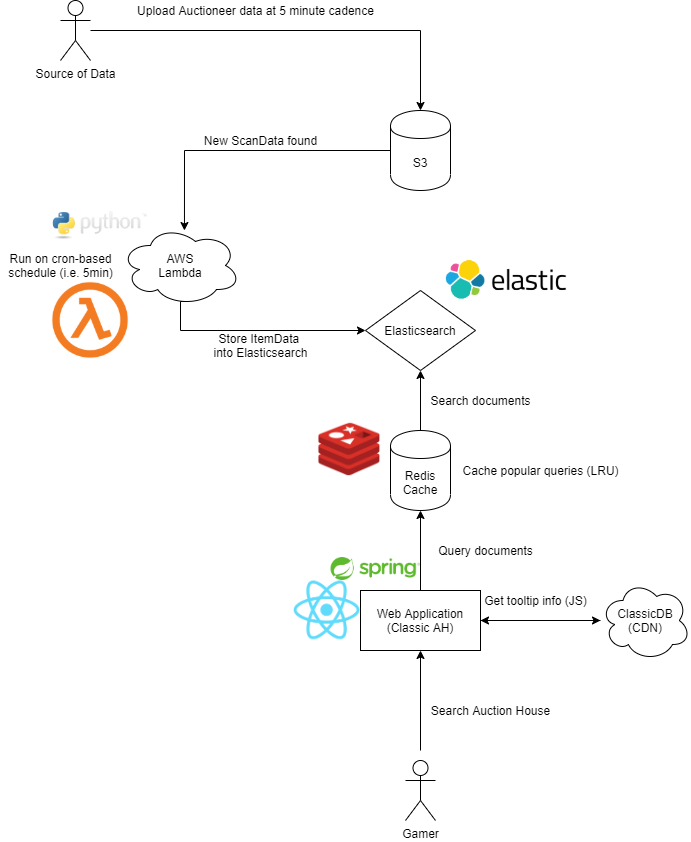

# Classic Auctions
An app that serves near real-time auctions with in-game Auctioneer data.

## The front-end has moved to a different repo!
The front-end of this project has been moved to a separate repository in conjunction with the Gatsby framework to allow for SEO and SSR-generated front-end. 
This means that this project is now responsible only for **API**.

As a result, the `HomeContoller` and Thyme templates will soon be removed.

Gatsby Repo: https://github.com/rkenmi/classic_auctions_gatsby

## Early stage diagram

## How to set up environment (on your system)

Pre-requisites that need to be installed:
- npm (for setting up React)
- Maven (for setting up Spring and pulling dependencies you need)
- Elasticsearch running on localhost:9200
- Redis running on localhost:6379
- Ask me for the S3 credentials (they will need to be placed in your `application-dev.properties` file).

### Installation
1. Run `mvn clean install` to build your Spring JAR and also build front-end assets with Webpack.
2. Run `mvn spring-boot:run -Dspring-boot.run.profiles=dev` to run the application server in development mode.
This will read off credentials from `application-dev.properties`, which you will need to adjust accordingly.
3. That's it! Open your browser and go to `http://localhost:8080` and you should see the server generated page.

## Nice to have (in the future)
- Docker and Docker Compose, for ease of local environment setup and deployments
